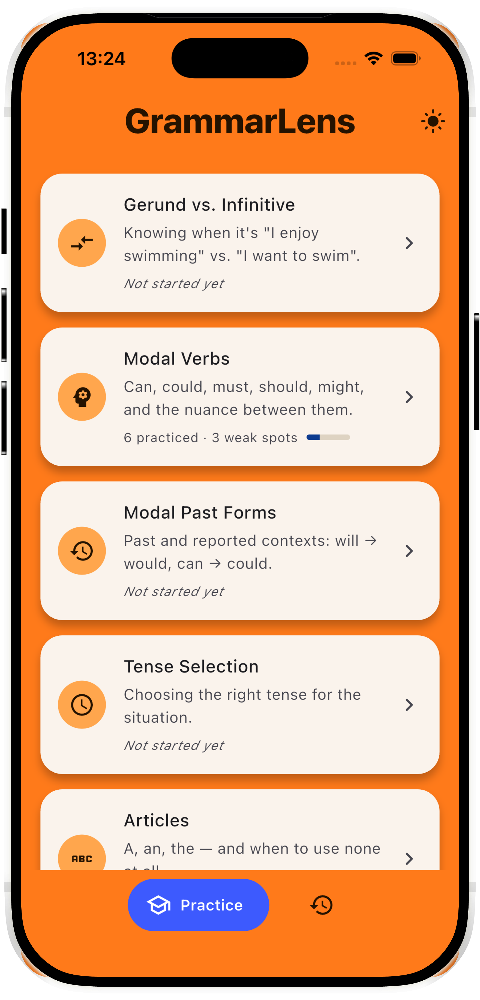
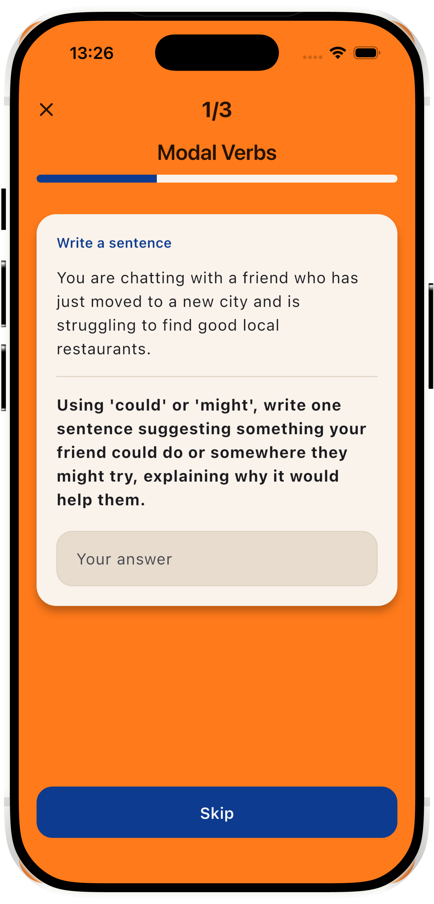
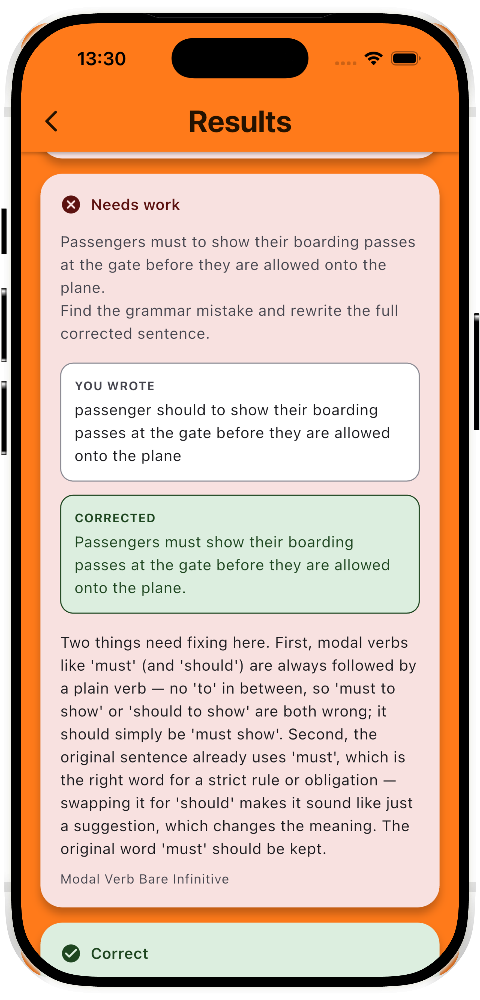
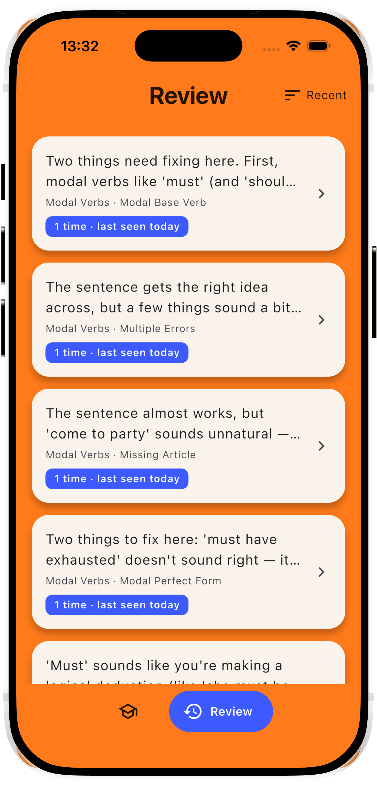
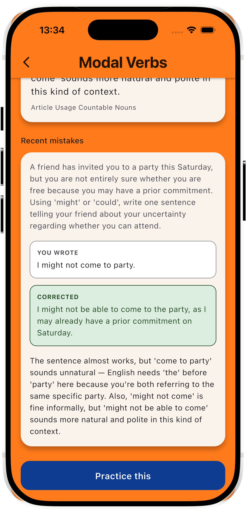

# GrammarLens (working title)

**An AI-powered grammar coach for people who learned English by speaking it — not by studying it.**

> Personal product case study, built in public: research → PRD → MVP → iteration.
> Status: **MVP (v1) complete, tested with real users, closed. v2 — a free/
> trial/paid pivot with a new daily mode — is functionally built; a visual
> polish pass is still pending before wider testing.** See
> [Product Evolution](#product-evolution) below.

## The Problem

Many English learners (including me) became fluent through conversation:
foreign friends, games, series. We can speak — but our grammar knowledge
is implicit. Ask us *why* it's "have been" and not "was", and we freeze.

Exams like IELTS demand explicit grammar accuracy. Existing apps don't
serve this segment well: beginner apps (Duolingo etc.) start too low and
move too slowly; grammar books are dry and not personalized; general LLM
chat has no memory of your recurring mistakes across sessions.

## The Idea

A mobile app (Flutter, iOS) that teaches grammar from **your own answers**,
with two entry points:

- **Daily Test** — free, forever, for everyone: a 5-question daily warm-up,
  the same set for every user, graded instantly with no AI call per
  answer. The always-free hook into the product.
- **Topic Practice** — the AI-personalized core loop, and the part that
  actually costs money to run: pick a topic and a session length
  (Quick · 3, Standard · 5, Extended · 10), answer a mixed set (sentence
  writing, error correction, fill-in-the-blank), and get instant,
  jargon-light feedback — what sounded wrong, what sounds natural, and
  why, with the grammar rule kept as secondary detail, not the headline.
  Free to try for 3 days, then a subscription. The purchase flow is built
  on RevenueCat and functional end-to-end, but no live App Store Connect
  product is connected yet, so no real subscription can complete today.

Mistakes from either mode feed a personal **error profile**; **Review**
resurfaces weak spots later with freshly generated practice — not the same
questions, real reinforcement.

AI is not a feature here — it's the foundation. A static rules-and-quizzes
app can't build a personalized curriculum from what you actually get wrong.

## Product Evolution

| Version | Timeframe | Screenshots | What it was |
|---|---|---|---|
| **v1 — MVP** | Jul–Aug 2026 | [`screenshots/v1/`](screenshots/v1/) | The original topic-mode build: pick a topic, answer a mixed question set, get plain-language feedback, review weak spots. Tested with real users, closed. |
| **v2** | Aug–Sep 2026 (in progress) | [`screenshots/v2/`](screenshots/v2/) — *pending, see note below* | Adds a free daily mode and moves Topic Practice from permanently-free to trial-then-subscription: it triggers a real Claude API call every session regardless of payment status, and a permanently free, unlimited version would have scaled cost directly with user count — unsustainable at the growth a public launch is meant to test for. Full reasoning in [`docs/prd-v2.md` §12.1](docs/prd-v2.md). |
| **v3 — planned, not yet scoped** | — | — | A possible future gamification-driven iteration is under consideration (see [`docs/roadmap.md`](docs/roadmap.md), "Later phases"). Not committed, no scope, no screens yet. |

**v2 screenshot note:** v2's screens (Daily Test, Paywall, the new
mode-selection Home/nav) are functionally done but deliberately not yet
visually polished — a dedicated design pass is planned before capturing
screenshots for `screenshots/v2/`.

## Screenshots (v1 / MVP)

| Home | Length selection | Practice |
|---|---|---|
|  |  |  |

| Correct answer | Incorrect answer | Skipped answer |
|---|---|---|
|  |  |  |

| Loading state | Review | Weak spot detail |
|---|---|---|
|  |  |  |

## Product Process

This project follows a structured product process, documented as it happens:

- [x] User research — interviews with 4 English learners, findings in [`docs/prd.md §2.1`](docs/prd.md)
- [x] Competitor analysis (informal, folded into PRD problem framing)
- [x] PRD → [`docs/prd.md`](docs/prd.md)
- [x] MVP prototype (Flutter + Claude API, structured JSON feedback)
- [x] Iteration 1 & 2 — question mix rebalanced toward production, plain-language
      feedback, error-frequency stats, deterministic skipped-answer handling
      (see [`docs/build-log.md`](docs/build-log.md))
- [x] Visual design pass — Material 3, custom orange/blue identity, light + dark mode
- [x] One-question-at-a-time flow, session length selection
- [x] User testing with real learners (in progress)
- [x] Public write-up (Medium)

## Key Product Decisions (and why)

- **Cost forced the monetization model, not the other way around.** Topic
  Practice triggers a real Claude API call every session, regardless of
  whether the user has paid — a permanently free, unlimited version scales
  cost directly with user count (rough estimate: ~$90–270/mo at 100 daily
  active users, ~$900–2,700/mo at 1,000). That made the original
  "everything free during early access" positioning unsustainable the
  moment growth became the goal. The alternative — a hard paywall in front
  of all value — was rejected too: it would mean nobody experiences the
  plain-language feedback that usability testers praised, undermining the
  actual thing a public launch exists to measure. Landed on a structural
  split instead: a free, deterministic daily mode with near-zero marginal
  cost, and a time-boxed trial of the real AI-personalized mode.
- **A new business constraint doesn't override a closed research finding.**
  The free daily mode needed some way to explain a wrong answer without a
  live LLM call per answer — the literal solution is multiple-choice-style
  "you picked B, the answer was A" framing. But multiple-choice had already
  been conclusively rejected by users (5 of 7 across two research rounds —
  see `docs/prd.md` §2.2 Theme 1) as feeling like guessing rather than
  production. Rather than reopening that finding under monetization
  pressure, kept free-text answer types and pre-generated the 2-3 most
  likely wrong answers — with canned explanations — alongside the question
  itself: reads as personalized, costs nothing extra since it rides the one
  generation call already being made.
- **Skipped ≠ wrong.** An unanswered question is not a grammar error. Detected
  deterministically in code (empty answer field) rather than trusting the
  model's own labeling, which varied between runs.
- **Error-correction is graded on the grammar fix, not the answer format.**
  If a user identifies and fixes the target error correctly but doesn't
  rewrite the full sentence, it's marked correct — the instruction was
  clarified instead of penalizing the user for a formatting assumption.
- **Grammar terminology is secondary.** Interview participants described
  rule names ("Past Perfect Continuous") as a barrier, not a help — the
  plain-language explanation leads; the rule name is a small caption.
- **The question mix shifted toward production** (sentence writing, error
  correction) after interviews showed multiple-choice/gap-fill practice
  felt useless to fluent-but-informal speakers — they can recognize
  correct grammar, they struggle to produce it under pressure.

## Scope Decisions (what's deliberately NOT in the MVP)

- No speech/audio features
- No gamification, streaks, levels
- No placement/level test — user self-selects topics and session length
- No accounts or cloud sync — local storage only
- Single language pair (Turkish → English) to start

## Local setup

The app needs an Anthropic API key at build/run time (`AppConfig` in
`lib/config/app_config.dart`); without it, Daily Test and Topic Practice
fail with a `ClaudeApiException` telling you to do the below.

1. Copy `config/dev.example.json` to `config/dev.json` and fill in your
   real key:
   ```json
   { "ANTHROPIC_API_KEY": "sk-ant-..." }
   ```
   `config/dev.json` is gitignored — it never gets committed.
2. Run it: `./scripts/dev.sh` — wraps
   `flutter run --dart-define-from-file=config/dev.json` so the flag
   never needs retyping by hand. Any extra arguments (e.g. `-d chrome`)
   pass straight through to `flutter run`.
   - **VS Code** users can use the "GrammarLens (dev)" launch config
     (`.vscode/launch.json`, committed) instead — same flag, wired to
     Run/Debug. `scripts/dev.sh` is the primary path since day-to-day
     development on this project happens from the terminal.
3. **Xcode**: hitting the Run button directly in Xcode does **not** pass
   any `--dart-define`/`--dart-define-from-file` flags — the app will
   build but every API call will fail with the missing-key error above.
   Launch from `scripts/dev.sh` or VS Code instead when you need the key.
4. **Release / TestFlight builds** need the same flag —
   `flutter build ipa --dart-define-from-file=config/dev.json` (or
   whatever config file holds the release key). Easy to forget since
   `flutter build ipa` alone still succeeds; the resulting build just
   fails the same missing-key check at runtime instead. The same class
   of mistake already happened once for a plain `flutter run`
   (`docs/build-log.md`, 2026-07-21, "Fixed a 401 'invalid API key'
   error") — worth spelling out explicitly here so it doesn't repeat for
   a release build.

## Stack

Flutter (iOS) · Anthropic API (Claude Sonnet, structured JSON outputs) ·
sqflite (local storage) · RevenueCat (subscriptions — built, no live
product connected yet) · Material 3 · AI-assisted development (Claude Code)

## About

Built by [Ahmet Emin Tayfur](https://www.linkedin.com/in/ahmettayfur) —
statistics graduate moving into product management. This repo doubles as
a learning-in-public log; process write-up on
[Medium](https://medium.com/@ahmet-tayfur).
