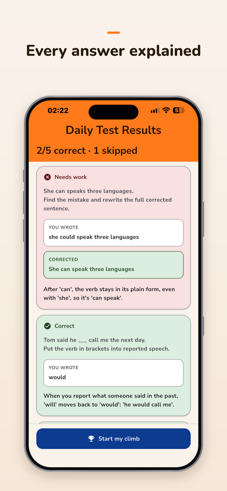
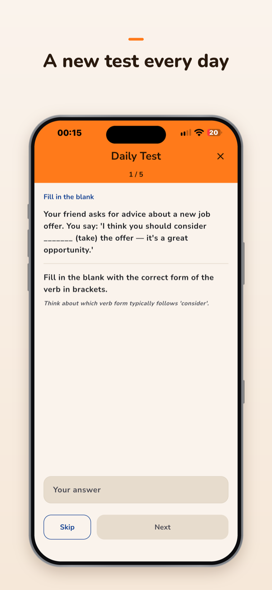
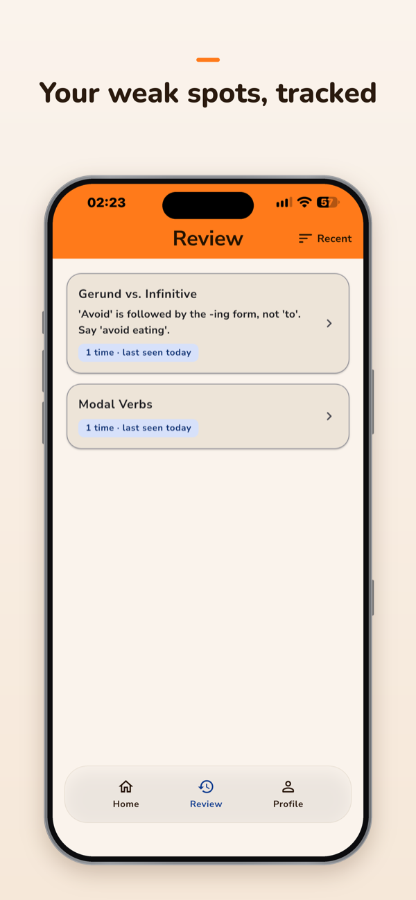
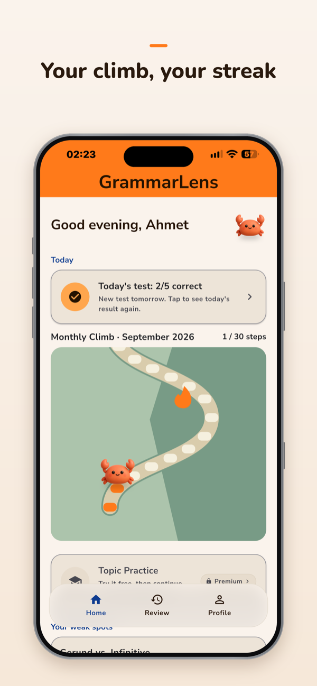
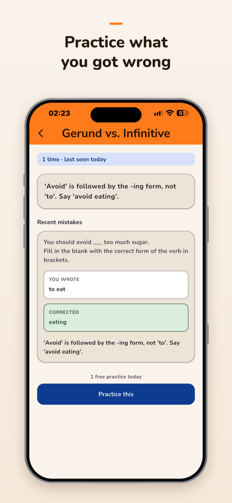
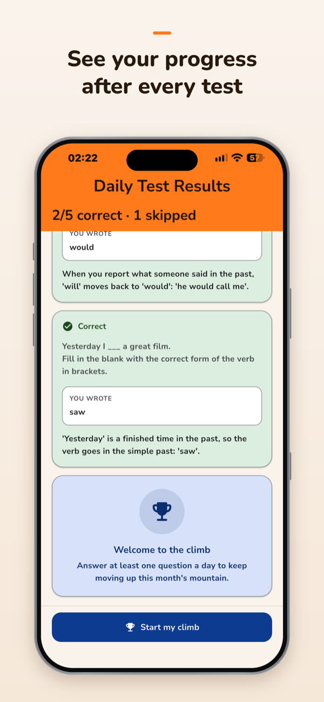
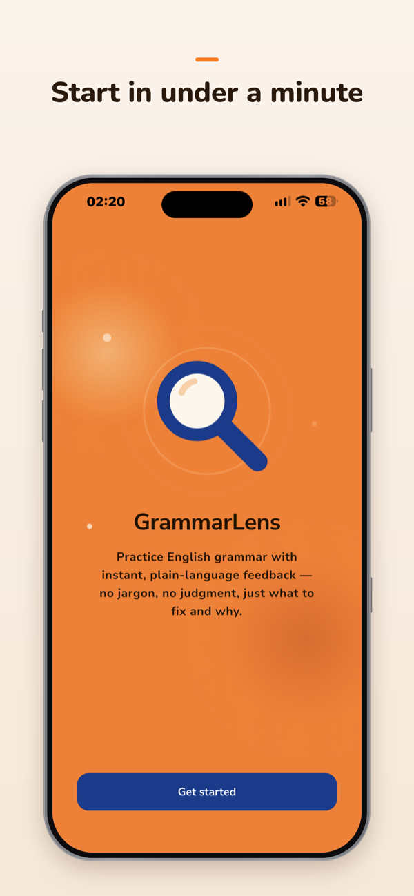
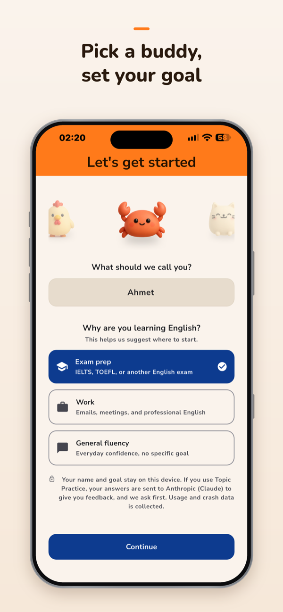

# GrammarLens

**An AI-powered grammar coach for people who learned English by speaking it, not by studying it.**

> **Status:** 1.0.0 submitted for App Store review on 24 September 2026. Not yet approved.

<p>
  
  
  
  
</p>
<p>
  
  
  
  
</p>

## What it does

- **Daily Test** (free): five questions a day, graded on the device, with a
  short explanation for every answer. The first day's test is a fixed,
  hand-written set; later days are generated. Wrong answers feed a personal
  error profile that Review shows as weak spots.
- **Topic Practice** (Premium): AI-generated question sets on a chosen topic,
  graded by AI with plain-language feedback. The app asks permission before
  practice answers are sent to the AI provider. Free users get one short
  session a day, started from a weak spot in Review. Plans, prices and trial
  lengths are loaded live from the store, not written in the app.
- **Monthly Climb**: each answered Daily Test moves your avatar one step up a
  monthly mountain, and a month's score earns a Bronze, Silver or Gold medal
  in Profile.

Known debts and open checks are listed in [`docs/roadmap.md`](docs/roadmap.md)
("Post-launch tasks" and the TestFlight checklist).

## Case study

The decisions behind the product, and what each one cost, are written up in
the [case study](https://ahmettayfur.com/products/grammarlens/case-study).

## Version history

| Version | When | What | Status |
|---|---|---|---|
| v1 — MVP | July 2026 | One-week sprint, user research, two iterations | Not released |
| v2 — product build-out | Aug–Sep 2026 | v2.1: free/paid split; v2.2: structure and visual pass; the API proxy; subscriptions | Not released |
| 1.0.0 | Sep 2026 | First App Store release: v2 plus Monthly Climb | Submitted for review 24 Sep 2026 (build 3); not yet approved; manual release |
| 1.1.0 | Next | Monthly themes, trail and environment fixes | Planned, not started |

<details>
<summary><strong>v1 (MVP) screenshots</strong></summary>

| Home | Length selection | Practice |
|---|---|---|
|  |  |  |

| Correct answer | Incorrect answer | Skipped answer |
|---|---|---|
|  |  |  |

| Loading state | Review | Weak spot detail |
|---|---|---|
|  |  |  |

</details>

<details>
<summary><strong>v2 screenshots</strong></summary>

| Onboarding | Home (empty) | Daily Test question |
|---|---|---|
|  |  |  |

| Daily Test results | Daily Test results (continued) | Home after use |
|---|---|---|
|  |  |  |

| Premium | Review | Weak spot detail |
|---|---|---|
|  |  |  |

| Settings | Change avatar | Home (dark) |
|---|---|---|
|  |  |  |

</details>

## Tech & docs

- **App:** Flutter / Dart, iOS only; local storage in sqflite (no accounts).
- **AI:** Anthropic's Claude through an operation-based Cloudflare Workers
  proxy (`proxy/`). The proxy owns the model, prompts and token limits and
  enforces daily quotas; the API key is never in the client.
- **Subscriptions:** RevenueCat.
- **Analytics and crashes:** Firebase Analytics and Crashlytics.

Docs:
- [`docs/roadmap.md`](docs/roadmap.md): current status and what's next
- [`docs/build-log.md`](docs/build-log.md): dated record of decisions and bugs
- [`docs/prd.md`](docs/prd.md) (MVP), [`docs/prd-v2.md`](docs/prd-v2.md) (v2),
  [`docs/prd-gamification.md`](docs/prd-gamification.md) (Monthly Climb)
- [`docs/analytics-plan.md`](docs/analytics-plan.md): launch events and how to read them
- [`docs/case-study-material.md`](docs/case-study-material.md): sourced raw material behind the case study

### Local setup

The Anthropic API key is not in the client at all — the app talks to a
small Cloudflare Workers proxy (`proxy/`) that holds it as a secret; see
`docs/build-log.md` for why (short version: a key compiled into a shipped
binary via `--dart-define` is extractable, so it moved behind a backend
that owns the model/prompt/schema for every call and enforces its own
quota). The app only needs two build-time values (`AppConfig` in
`lib/config/app_config.dart`): where the proxy is, and an app token: without
them, Daily Test and Topic Practice fail with a `ClaudeApiException`
telling you to do the below.

1. Copy `config/dev.example.json` to `config/dev.json`:
   ```json
   { "PROXY_BASE_URL": "http://localhost:8787", "APP_TOKEN": "..." }
   ```
   `APP_TOKEN` here just has to match whatever you put in the proxy's own
   `proxy/.dev.vars` (see `proxy/README.md`) — pick any string for local
   dev. `config/dev.json` is gitignored — it never gets committed.
2. Run it: `./scripts/dev.sh` — starts the proxy locally (`wrangler dev`,
   in the background, only if nothing's already listening on its port)
   and then runs `flutter run --dart-define-from-file=config/dev.json`, so
   one command brings up both halves. Any extra arguments (e.g.
   `-d chrome`) pass straight through to `flutter run`. First time only:
   copy `proxy/.dev.vars.example` to `proxy/.dev.vars` and fill in a real
   Anthropic API key (see `proxy/README.md`) — that's the only place a
   real key needs to exist on a dev machine.
   - **Testing against the live proxy instead of `wrangler dev`**: the
     proxy also lives at the permanent `https://api.ahmettayfur.com`
     (Cloudflare Workers custom domain — see `proxy/wrangler.jsonc`).
     Temporarily set `config/dev.json`'s `PROXY_BASE_URL` to that and
     `APP_TOKEN` to the real deployed secret (`config/prod.json`'s value,
     if you have it) — `./scripts/dev.sh` detects a non-localhost URL and
     skips starting a local proxy. Revert both back to `localhost:8787`
     and the local dev token afterward: every call against the live
     address spends a real Anthropic request and counts against
     production's daily quota, so this isn't the default for a reason.
   - **VS Code** users can use the "GrammarLens (dev)" launch config
     (`.vscode/launch.json`, committed) instead — same flag, wired to
     Run/Debug, but doesn't start the proxy for you; run `npm run dev` in
     `proxy/` yourself first. `scripts/dev.sh` is the primary path since
     day-to-day development on this project happens from the terminal.
   - **Physical device**: `scripts/dev.sh` is simulator-only —
     `config/dev.json`'s `PROXY_BASE_URL` points at `localhost`, which on a
     real device means the device itself, so every proxy call fails. Use
     `flutter run --dart-define-from-file=config/prod.json -d <device-id>`
     instead.
3. **Xcode**: hitting the Run button directly in Xcode does **not** pass
   any `--dart-define`/`--dart-define-from-file` flags — the app will
   build but every API call will fail with the missing-config error
   above. Launch from `scripts/dev.sh` or VS Code instead when you need
   it configured.
4. **Release / TestFlight builds** use a separate `config/prod.json`
   (copy `config/prod.example.json`, fill in the real deployed proxy URL
   and app token — see `proxy/README.md` for deploying it) and need the
   matching flag: `flutter build ipa
   --dart-define-from-file=config/prod.json`. Easy to forget since
   `flutter build ipa` alone still succeeds; the resulting build just
   fails the same missing-config check at runtime instead. The same
   class of mistake already happened once for a plain `flutter run`
   (`docs/build-log.md`, 2026-07-21, "Fixed a 401 'invalid API key'
   error") — worth spelling out explicitly here so it doesn't repeat for
   a release build.
5. **Run `./scripts/preflight.sh` before every `flutter build ipa`** (so
   before every TestFlight or App Store build). It checks that pre-launch
   requirements which are easy to forget mid-build — `AppLinks`' Privacy
   Policy/Terms URLs, and `config/prod.json`'s proxy URL/app token — are
   actually set, and exits non-zero naming exactly what's missing if not.
   It also deletes any macOS `.DS_Store` file under `assets/` and lists
   what it deleted: Flutter bundles every file in a registered asset
   folder, so these would otherwise ship inside the app. More checks land
   here over time rather than each as its own script.

#### Visual previews (no build config needed)

`lib/preview/` holds standalone, debug-only entry points for checking a
feature's every visual state on a device without seeding real data or
waiting for something to happen (a month rollover, a finalized medal) —
each is its own `main()`, guarded by `if (!kDebugMode) throw
StateError(...)` so it can never run in a release build, and none of them
touch `StorageService` or the real `grammar_lens.db`. Unlike the app
itself, these need no `config/dev.json`/proxy setup at all.

- **Monthly Climb** (`lib/preview/monthly_climb_preview.dart`): the
  mountain/route/avatar visual, with sample-progress and month-length
  controls.
- **Monthly Medal** (`lib/preview/monthly_medal_preview.dart`): every
  medal state — In progress, each finalized tier, "No medal", and several
  finalized months at once — with in-preview dark-mode and Small/Medium/
  Large text-size toggles, so a device acceptance pass can check all of
  them without a real month ever rolling over.

Run either directly with `flutter run -t <path>`, or use
`./scripts/preview_monthly_medal.sh` for the medal one (thin wrapper, no
VS Code needed — day-to-day development on this project happens from the
terminal, same as `scripts/dev.sh`). On a physical iPhone: plug it in,
confirm it shows up with `flutter devices`, then
`./scripts/preview_monthly_medal.sh -d <device-id>` (any extra arguments
pass straight through to `flutter run`).

## Credits

The avatar set is adapted from
["Cute Animal 3D Icons"](https://www.figma.com/community/file/1514963172455082116/cute-animal-3d-icons)
by Tran Mau Tri Tam (Figma Community), licensed under
[CC BY 4.0](https://creativecommons.org/licenses/by/4.0/); adapted (PNG →
WebP, resized).

## About

Built by [Ahmet Emin Tayfur](https://www.linkedin.com/in/ahmettayfur):
statistics graduate moving into product management. This repo doubles as a
learning-in-public log; process write-up on
[Medium](https://medium.com/@ahmet-tayfur).
