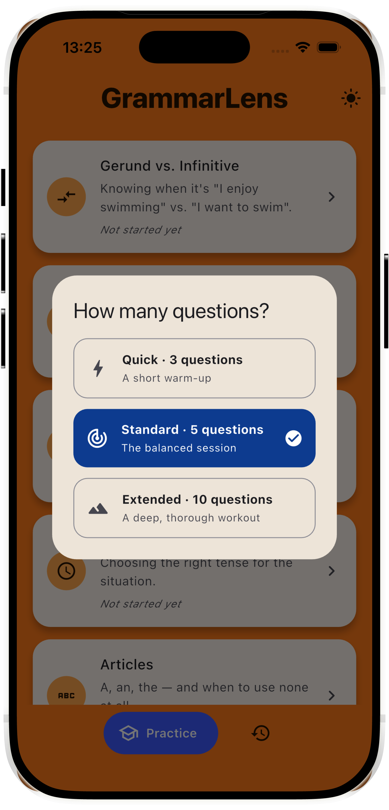
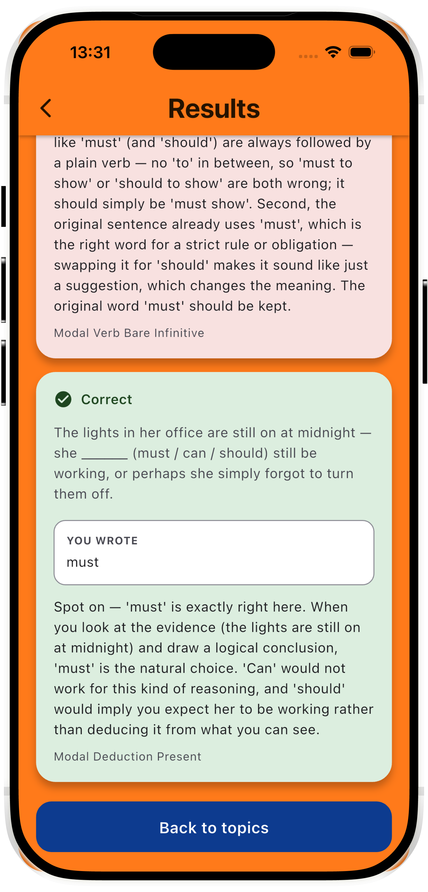
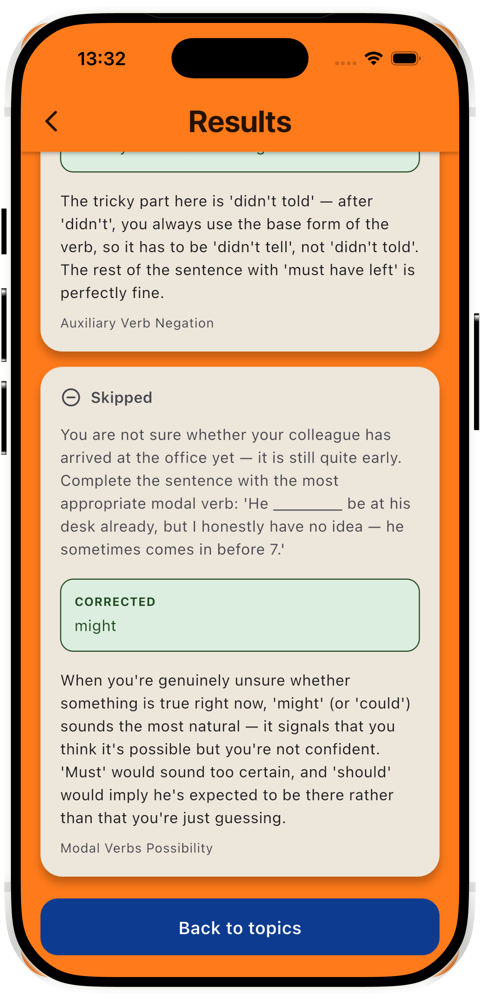
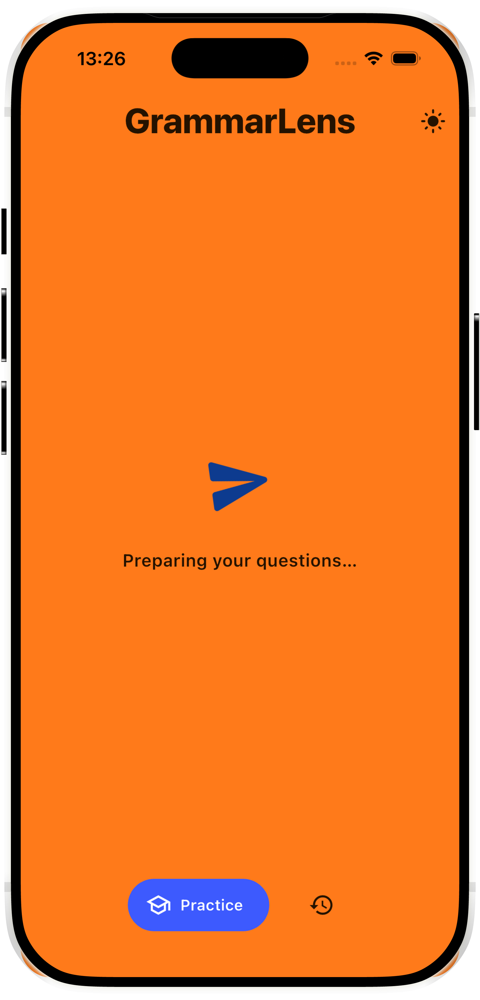

# GrammarLens (working title)

**An AI-powered grammar coach for people who learned English by speaking it — not by studying it.**

> Personal product case study, built in public: research → PRD → MVP → iteration.
> Status: **MVP complete, iterating based on real testing.**

## The Problem

Many English learners (including me) became fluent through conversation:
foreign friends, games, series. We can speak — but our grammar knowledge
is implicit. Ask us *why* it's "have been" and not "was", and we freeze.

Exams like IELTS demand explicit grammar accuracy. Existing apps don't
serve this segment well: beginner apps (Duolingo etc.) start too low and
move too slowly; grammar books are dry and not personalized; general LLM
chat has no memory of your recurring mistakes across sessions.

## The Idea

A mobile app (Flutter, iOS) that teaches grammar from **your own answers**:

1. Pick a topic and a session length (Quick · 3, Standard · 5, Extended · 10)
2. Answer a mixed set — sentence writing, error correction, fill-in-the-blank
3. Get instant, jargon-light feedback: what sounded wrong, what sounds
   natural, and why — with the grammar rule kept as secondary detail, not
   the headline
4. Mistakes are saved to a personal **error profile**
5. **Review** resurfaces your weak spots later with freshly generated
   practice — not the same questions, real reinforcement

AI is not a feature here — it's the foundation. A static rules-and-quizzes
app can't build a personalized curriculum from what you actually get wrong.

## Screenshots

| Home | Length selection | Practice |
|---|---|---|
|  |  |  |

| Correct answer | Incorrect answer | Skipped answer |
|---|---|---|
|  |  |  |

| Loading state | Review | Weak spot detail |
|---|---|---|
|  |  |  |

## Product Process

This project follows a structured product process, documented as it happens:

- [x] User research — interviews with 4 English learners, findings in [`docs/prd.md §2.1`](docs/prd.md)
- [x] Competitor analysis (informal, folded into PRD problem framing)
- [x] PRD → [`docs/prd.md`](docs/prd.md)
- [x] MVP prototype (Flutter + Claude API, structured JSON feedback)
- [x] Iteration 1 & 2 — question mix rebalanced toward production, plain-language
      feedback, error-frequency stats, deterministic skipped-answer handling
      (see [`docs/build-log.md`](docs/build-log.md))
- [x] Visual design pass — Material 3, custom orange/blue identity, light + dark mode
- [x] One-question-at-a-time flow, session length selection
- [ ] User testing with real learners (in progress)
- [ ] Public write-up (Medium)

## Key Product Decisions (and why)

- **Skipped ≠ wrong.** An unanswered question is not a grammar error. Detected
  deterministically in code (empty answer field) rather than trusting the
  model's own labeling, which varied between runs.
- **Error-correction is graded on the grammar fix, not the answer format.**
  If a user identifies and fixes the target error correctly but doesn't
  rewrite the full sentence, it's marked correct — the instruction was
  clarified instead of penalizing the user for a formatting assumption.
- **Grammar terminology is secondary.** Interview participants described
  rule names ("Past Perfect Continuous") as a barrier, not a help — the
  plain-language explanation leads; the rule name is a small caption.
- **The question mix shifted toward production** (sentence writing, error
  correction) after interviews showed multiple-choice/gap-fill practice
  felt useless to fluent-but-informal speakers — they can recognize
  correct grammar, they struggle to produce it under pressure.

## Scope Decisions (what's deliberately NOT in the MVP)

- No speech/audio features
- No gamification, streaks, levels
- No placement/level test — user self-selects topics and session length
- No accounts or cloud sync — local storage only
- Single language pair (Turkish → English) to start

## Stack

Flutter (iOS) · Anthropic API (Claude Sonnet, structured JSON outputs) ·
sqflite (local storage) · Material 3 · AI-assisted development (Claude Code)

## About

Built by [Ahmet Emin Tayfur](https://www.linkedin.com/in/ahmettayfur) —
statistics graduate moving into product management. This repo doubles as
a learning-in-public log; process write-up on
[Medium](https://medium.com/@ahmet-tayfur).
