# GrammarLens (working title)

**An AI-powered grammar coach for people who learned English by speaking it — not by studying it.**

> Personal product case study, built in public: research → PRD → MVP → iteration.
> Status: **MVP (v1) complete, tested with real users, closed. v2 — a free/
> trial/paid pivot with a new daily mode — is functionally built and
> visually polished** (see [`docs/design-audit.md`](docs/design-audit.md));
> one known debt remains, the paywall's density on the smallest supported
> screen width. **Pre-launch**: not on the App Store, no TestFlight build
> yet, and the subscription products themselves don't exist in App Store
> Connect yet (see [`docs/roadmap.md`](docs/roadmap.md) for current
> wiring). **v3 is planned but not scoped or built** — a gamification layer
> and a Home redesign. See [Product Evolution](#product-evolution) below.

## The Problem

Many English learners (including me) became fluent through conversation:
foreign friends, games, series. We can speak — but our grammar knowledge
is implicit. Ask us *why* it's "have been" and not "was", and we freeze.

Exams like IELTS demand explicit grammar accuracy. Existing apps don't
serve this segment well: beginner apps (Duolingo etc.) start too low and
move too slowly; grammar books are dry and not personalized; general LLM
chat has no memory of your recurring mistakes across sessions.

## The Idea

A mobile app (Flutter, iOS) that teaches grammar from **your own answers**,
with two entry points:

- **Daily Test** — free, forever, for everyone: a 5-question daily warm-up,
  the same set for every user, graded instantly with no AI call per
  answer. The always-free hook into the product.
- **Topic Practice** — the AI-personalized core loop, and the part that
  actually costs money to run: pick a topic and a session length
  (Quick · 3, Standard · 5, Extended · 10), answer a mixed set (sentence
  writing, error correction, fill-in-the-blank), and get instant,
  jargon-light feedback — what sounded wrong, what sounds natural, and
  why, with the grammar rule kept as secondary detail, not the headline.
  Free to try (a payment method is required up front, per standard App
  Store subscription mechanics — it auto-renews unless cancelled), then a
  subscription. Free-tier users (trial declined or
  expired) still get one Topic Practice session per day at no cost,
  reachable from a weak spot in Review. The purchase flow is built on
  RevenueCat and functional end-to-end, but no live App Store Connect
  product is connected yet, so no real subscription can complete today.

Mistakes from either mode feed a personal **error profile**; **Review**
resurfaces weak spots later with freshly generated practice — not the same
questions, real reinforcement.

AI is not a feature here — it's the foundation. A static rules-and-quizzes
app can't build a personalized curriculum from what you actually get wrong.

## Product Evolution

| Version | Timeframe | Screenshots | What it was |
|---|---|---|---|
| **v1 — MVP** | Jul–Aug 2026 | [`screenshots/v1/`](screenshots/v1/) | The original topic-mode build: pick a topic, answer a mixed question set, get plain-language feedback, review weak spots. Tested with real users, closed. |
| **v2** | Aug–Sep 2026 | [Screenshots (v2)](#screenshots-v2) below | Adds a free daily mode and moves Topic Practice from permanently-free to trial-then-subscription: it triggers a real Claude API call every session regardless of payment status, and a permanently free, unlimited version would have scaled cost directly with user count — unsustainable at the growth a public launch is meant to test for. Full reasoning in [`docs/prd-v2.md` §12.1](docs/prd-v2.md). This is the current build. |
| **v3 — planned, not yet scoped** | — | — | Two directions under consideration, neither built: a gamification layer (a "Monthly Climb" progression mechanic, redesigned from an earlier weekly-cycle draft — see [`docs/prd-gamification.md`](docs/prd-gamification.md), status draft, design work happening outside this repo) and a Home screen redesign. No scope, no screens, no code in this repo yet. |

<details>
<summary><strong>Screenshots (v1 / MVP)</strong></summary>

| Home | Length selection | Practice |
|---|---|---|
|  |  |  |

| Correct answer | Incorrect answer | Skipped answer |
|---|---|---|
|  |  |  |

| Loading state | Review | Weak spot detail |
|---|---|---|
|  |  |  |

</details>

## Screenshots (v2)

| Onboarding | Home (empty) | Daily Test question |
|---|---|---|
| 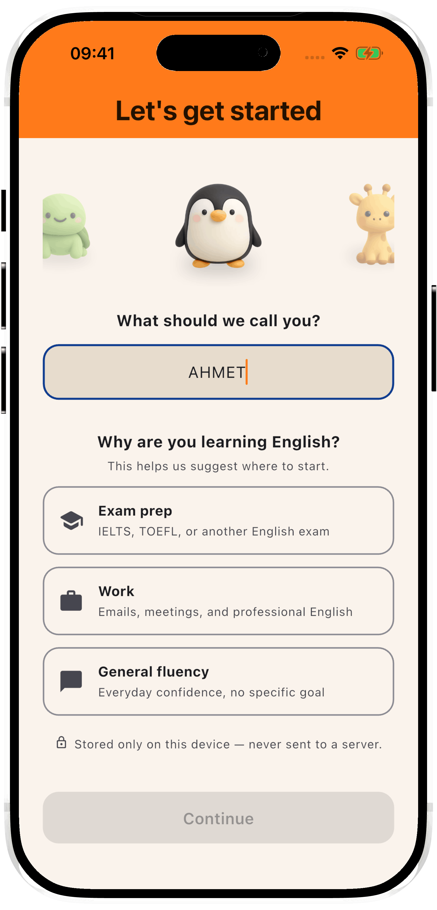 | 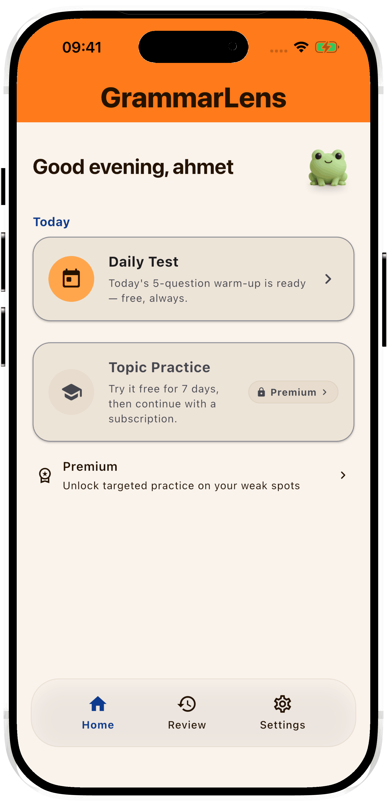 | 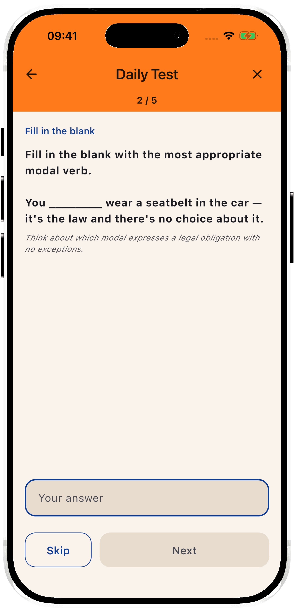 |

| Daily Test results | Daily Test results (continued) | Home after use — daily free practice used, Topic Practice locked |
|---|---|---|
| 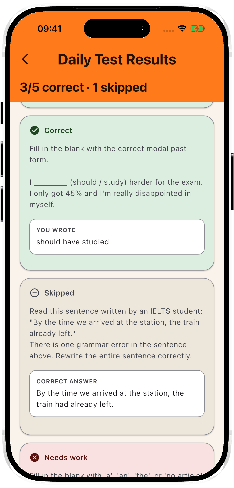 | 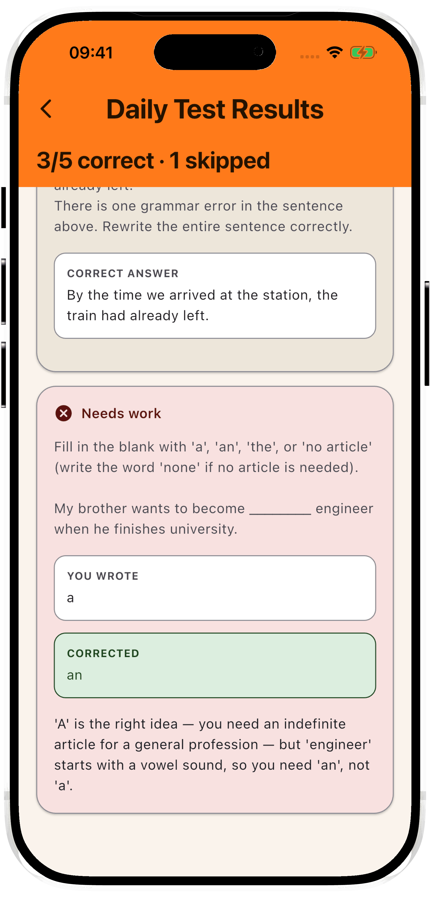 | 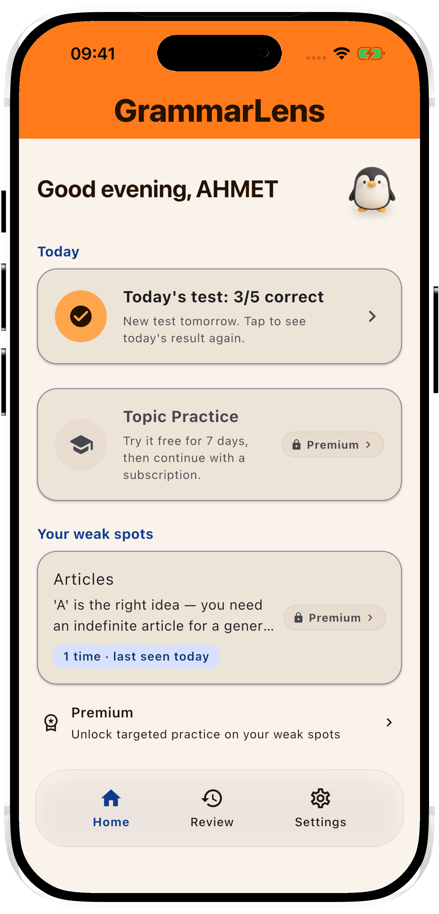 |

| Premium | Review | Weak spot detail |
|---|---|---|
| 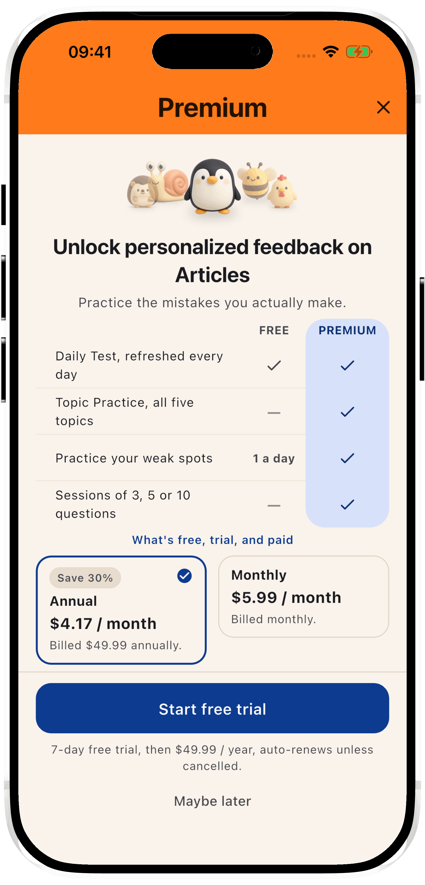 | 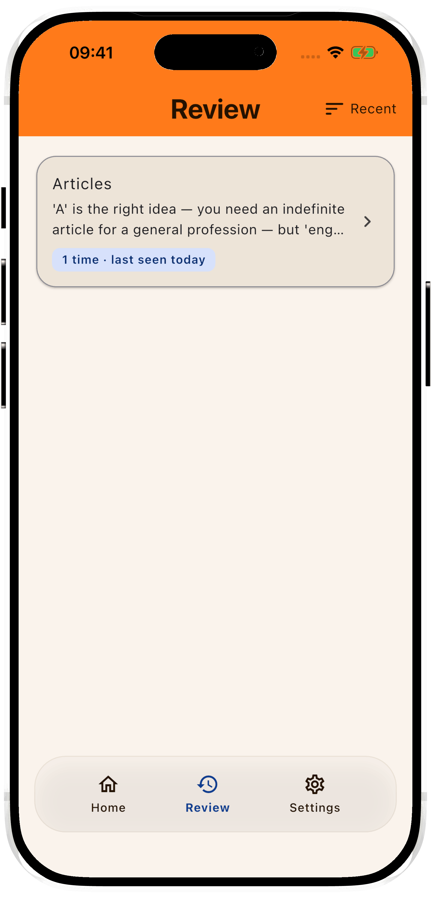 | 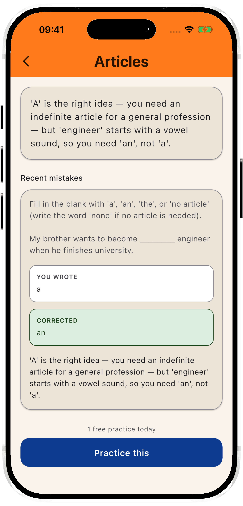 |

| Settings | Change avatar | Home (dark) |
|---|---|---|
| 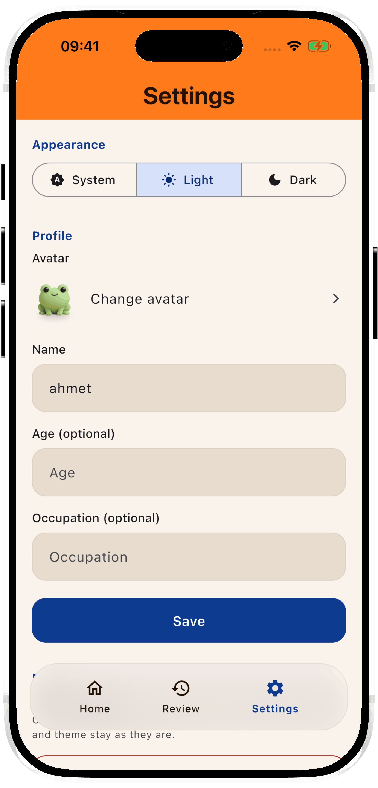 | 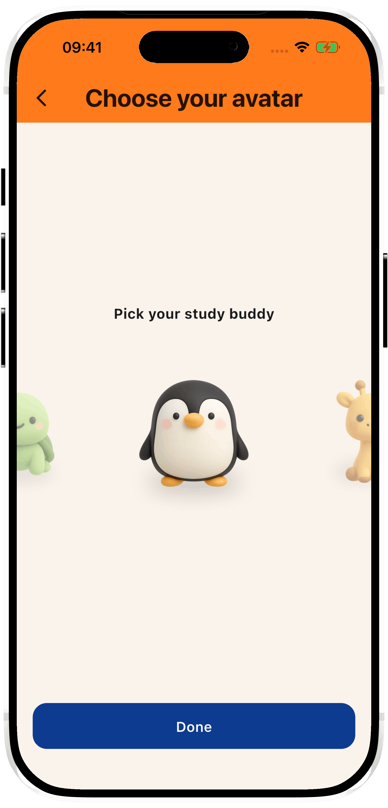 | 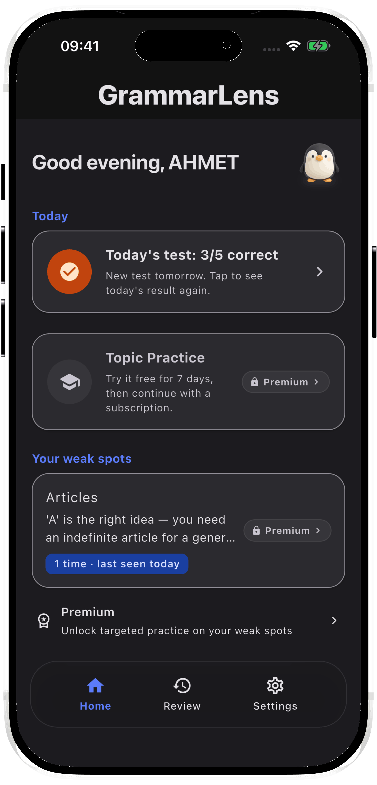 |

## Product Process

This project follows a structured product process, documented as it happens:

- [x] User research — interviews with 4 English learners, findings in [`docs/prd.md §2.1`](docs/prd.md)
- [x] Competitor analysis (informal, folded into PRD problem framing)
- [x] PRD → [`docs/prd.md`](docs/prd.md)
- [x] MVP prototype (Flutter + Claude API, structured JSON feedback)
- [x] Iteration 1 & 2 — question mix rebalanced toward production, plain-language
      feedback, error-frequency stats, deterministic skipped-answer handling
      (see [`docs/build-log.md`](docs/build-log.md))
- [x] Visual design pass — Material 3, custom orange/blue identity, light + dark mode
- [x] One-question-at-a-time flow, session length selection
- [x] User testing with real learners — 3 participants (T1–T3), closed
      (below the original 5+ target, a deliberate call — see
      [`docs/prd.md` §2.2](docs/prd.md) for the sample-size note)
- [x] Public write-up (Medium)

## Key Product Decisions (and why)

- **Cost forced the monetization model, not the other way around.** Topic
  Practice triggers a real Claude API call every session, regardless of
  whether the user has paid — a permanently free, unlimited version scales
  cost directly with user count (rough estimate: ~$90–270/mo at 100 daily
  active users, ~$900–2,700/mo at 1,000). That made the original
  "everything free during early access" positioning unsustainable the
  moment growth became the goal. The alternative — a hard paywall in front
  of all value — was rejected too: it would mean nobody experiences the
  plain-language feedback that usability testers praised, undermining the
  actual thing a public launch exists to measure. Landed on a structural
  split instead: a free, deterministic daily mode with near-zero marginal
  cost, and a time-boxed trial of the real AI-personalized mode.
- **A new business constraint doesn't override a closed research finding.**
  The free daily mode needed some way to explain a wrong answer without a
  live LLM call per answer — the literal solution is multiple-choice-style
  "you picked B, the answer was A" framing. But multiple-choice had already
  been conclusively rejected by users (5 of 7 across two research rounds —
  see `docs/prd.md` §2.2 Theme 1) as feeling like guessing rather than
  production. Rather than reopening that finding under monetization
  pressure, kept free-text answer types and pre-generated the 2-3 most
  likely wrong answers — with canned explanations — alongside the question
  itself: reads as personalized, costs nothing extra since it rides the one
  generation call already being made.
- **Skipped ≠ wrong.** An unanswered question is not a grammar error. Detected
  deterministically in code (empty answer field) rather than trusting the
  model's own labeling, which varied between runs.
- **Error-correction is graded on the grammar fix, not the answer format.**
  If a user identifies and fixes the target error correctly but doesn't
  rewrite the full sentence, it's marked correct — the instruction was
  clarified instead of penalizing the user for a formatting assumption.
- **Grammar terminology is secondary.** Interview participants described
  rule names ("Past Perfect Continuous") as a barrier, not a help — the
  plain-language explanation leads; the rule name is a small caption.
- **The question mix shifted toward production** (sentence writing, error
  correction) after interviews showed multiple-choice/gap-fill practice
  felt useless to fluent-but-informal speakers — they can recognize
  correct grammar, they struggle to produce it under pressure.

## Scope Decisions (what's deliberately NOT in the MVP)

_v1/MVP scope only — see [Product Evolution](#product-evolution) for what
v2 adds and what v3 is considering._

- No speech/audio features
- No gamification, streaks, levels
- No placement/level test — user self-selects topics and session length
- No accounts or cloud sync — local storage only
- Single language pair (Turkish → English) to start

## Local setup

The Anthropic API key is not in the client at all — the app talks to a
small Cloudflare Workers proxy (`proxy/`) that holds it as a secret; see
`docs/build-log.md` for why (short version: a key compiled into a shipped
binary via `--dart-define` is extractable, so it moved behind a backend
that owns the model/prompt/schema for every call and enforces its own
quota). The app only needs two build-time values (`AppConfig` in
`lib/config/app_config.dart`): where the proxy is, and an app token: without
them, Daily Test and Topic Practice fail with a `ClaudeApiException`
telling you to do the below.

1. Copy `config/dev.example.json` to `config/dev.json`:
   ```json
   { "PROXY_BASE_URL": "http://localhost:8787", "APP_TOKEN": "..." }
   ```
   `APP_TOKEN` here just has to match whatever you put in the proxy's own
   `proxy/.dev.vars` (see `proxy/README.md`) — pick any string for local
   dev. `config/dev.json` is gitignored — it never gets committed.
2. Run it: `./scripts/dev.sh` — starts the proxy locally (`wrangler dev`,
   in the background, only if nothing's already listening on its port)
   and then runs `flutter run --dart-define-from-file=config/dev.json`, so
   one command brings up both halves. Any extra arguments (e.g.
   `-d chrome`) pass straight through to `flutter run`. First time only:
   copy `proxy/.dev.vars.example` to `proxy/.dev.vars` and fill in a real
   Anthropic API key (see `proxy/README.md`) — that's the only place a
   real key needs to exist on a dev machine.
   - **Testing against the live proxy instead of `wrangler dev`**: the
     proxy also lives at the permanent `https://api.ahmettayfur.com`
     (Cloudflare Workers custom domain — see `proxy/wrangler.jsonc`).
     Temporarily set `config/dev.json`'s `PROXY_BASE_URL` to that and
     `APP_TOKEN` to the real deployed secret (`config/prod.json`'s value,
     if you have it) — `./scripts/dev.sh` detects a non-localhost URL and
     skips starting a local proxy. Revert both back to `localhost:8787`
     and the local dev token afterward: every call against the live
     address spends a real Anthropic request and counts against
     production's daily quota, so this isn't the default for a reason.
   - **VS Code** users can use the "GrammarLens (dev)" launch config
     (`.vscode/launch.json`, committed) instead — same flag, wired to
     Run/Debug, but doesn't start the proxy for you; run `npm run dev` in
     `proxy/` yourself first. `scripts/dev.sh` is the primary path since
     day-to-day development on this project happens from the terminal.
   - **Physical device**: `scripts/dev.sh` is simulator-only —
     `config/dev.json`'s `PROXY_BASE_URL` points at `localhost`, which on a
     real device means the device itself, so every proxy call fails. Use
     `flutter run --dart-define-from-file=config/prod.json -d <device-id>`
     instead.
3. **Xcode**: hitting the Run button directly in Xcode does **not** pass
   any `--dart-define`/`--dart-define-from-file` flags — the app will
   build but every API call will fail with the missing-config error
   above. Launch from `scripts/dev.sh` or VS Code instead when you need
   it configured.
4. **Release / TestFlight builds** use a separate `config/prod.json`
   (copy `config/prod.example.json`, fill in the real deployed proxy URL
   and app token — see `proxy/README.md` for deploying it) and need the
   matching flag: `flutter build ipa
   --dart-define-from-file=config/prod.json`. Easy to forget since
   `flutter build ipa` alone still succeeds; the resulting build just
   fails the same missing-config check at runtime instead. The same
   class of mistake already happened once for a plain `flutter run`
   (`docs/build-log.md`, 2026-07-21, "Fixed a 401 'invalid API key'
   error") — worth spelling out explicitly here so it doesn't repeat for
   a release build.
5. **Run `./scripts/preflight.sh` before `flutter build ipa`.** It checks
   that pre-launch requirements which are easy to forget mid-build —
   `AppLinks`' Privacy Policy/Terms URLs, and `config/prod.json`'s proxy
   URL/app token — actually being set, and exits non-zero naming exactly
   what's missing if not. More checks land here over time rather than
   each as its own script.

### Visual previews (no build config needed)

`lib/preview/` holds standalone, debug-only entry points for checking a
feature's every visual state on a device without seeding real data or
waiting for something to happen (a month rollover, a finalized medal) —
each is its own `main()`, guarded by `if (!kDebugMode) throw
StateError(...)` so it can never run in a release build, and none of them
touch `StorageService` or the real `grammar_lens.db`. Unlike the app
itself, these need no `config/dev.json`/proxy setup at all.

- **Monthly Climb** (`lib/preview/monthly_climb_preview.dart`): the
  mountain/route/avatar visual, with sample-progress and month-length
  controls.
- **Monthly Medal** (`lib/preview/monthly_medal_preview.dart`): every
  medal state — In progress, each finalized tier, "No medal", and several
  finalized months at once — with in-preview dark-mode and Small/Medium/
  Large text-size toggles, so a device acceptance pass can check all of
  them without a real month ever rolling over.

Run either directly with `flutter run -t <path>`, or use
`./scripts/preview_monthly_medal.sh` for the medal one (thin wrapper, no
VS Code needed — day-to-day development on this project happens from the
terminal, same as `scripts/dev.sh`). On a physical iPhone: plug it in,
confirm it shows up with `flutter devices`, then
`./scripts/preview_monthly_medal.sh -d <device-id>` (any extra arguments
pass straight through to `flutter run`).

## Stack

Flutter (iOS) · Anthropic API via a Cloudflare Workers proxy (Claude
Sonnet, structured JSON outputs — see `proxy/`) · sqflite (local storage)
· Firebase Analytics + Crashlytics (connected and collecting, iOS only —
see `docs/roadmap.md` "Current wiring") · RevenueCat (subscriptions —
built, no live product connected yet) · Material 3 · AI-assisted
development (Claude Code)

## About

Built by [Ahmet Emin Tayfur](https://www.linkedin.com/in/ahmettayfur) —
statistics graduate moving into product management. This repo doubles as
a learning-in-public log; process write-up on
[Medium](https://medium.com/@ahmet-tayfur).
